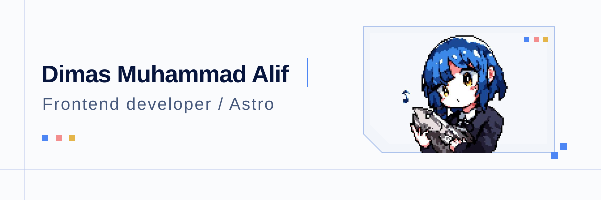

  

<picture>
  <source
    media="(prefers-color-scheme: dark)"
    srcset="https://skillicons.dev/icons?i=astro,ts,js,react,laravel,bootstrap,py,html,css,git,github,vscode&theme=dark&perline=12"
  />
  <source
    media="(prefers-color-scheme: light)"
    srcset="https://skillicons.dev/icons?i=astro,ts,js,react,laravel,bootstrap,py,html,css,git,github,vscode&theme=light&perline=12"
  />
  
</picture>

 

<table>
  <tr>
    <td valign="top" width="50%">

### About

Frontend developer focused on **Astro** and modern web development.

I care about clean structure, responsive interfaces, and maintainable code.

   </td>
    <td valign="top" width="50%">

### Current Focus

- Astro-first frontend development
- Component Architecture
- Performance Optimalization
- Accessibility
- Technical SEO

   </td>
  </tr>
</table>
